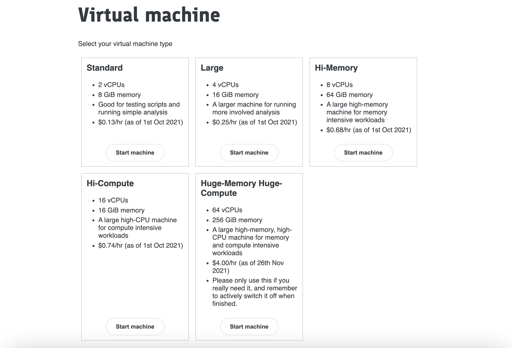

# 

## **Starting the TRE**

Having selected your [_username@genesandhealth.qmul.ac.uk_](mailto:username@genesandhealth.qmul.ac.uk) account as your Chrome Profile, point your Chrome browser to one of the following URLs:

- __New TRE__ - [https://new-production.genesandhealth.qmul.ac.uk/](https://new-production.genesandhealth.qmul.ac.uk) - If you've been notified that your sandbox has been transitioned to the new version.
- __Old TRE__ [https://qmul-production.genesandhealth.qmul.ac.uk/](https://qmul-production.genesandhealth.qmul.ac.uk)

This will take you to the TRE login page. You will be asked to enter your username and password. The username is the one you have been given by the Genes and Health team, and the password is the one you have set up when you first logged in.

If you want to go a specific sandbox, you can use the following URL, and replace the sandbox number with the one you want to access:

import SandboxSelectorWithOldNewLinks from '@site/src/components/sandbox_urls';

<SandboxSelectorWithOldNewLinks />

## Choosing your required machine configuration

Once logged in, you will be taken to the **Virtual Machines** page where you can start a new machine or connect to an existing one.

You will be offered a variety of virtual machine types.

:::warning

Choose the **Standard** machine unless a script requires high memory or increased CPU capacity. Test your script on the Standard machine first, as other options are more expensive.

:::

**Note**: Some machine types have many CPUs, which are suitable for multithreaded applications like plink or regenie that can fully utilise them. These applications may sometimes run input/output operations too quickly for standard Google bucket storage, requiring you to copy key files to faster local storage (see below).

## Switching off the machine

Your virtual machine will keep running for 48 hours if you are doing nothing. You can disconnect from Chrome, turn your laptop off, and then you will be straight back into the exact same machine when you connect again (within 48h). If you have Linux jobs running, the machine will keep going while these run (however long) plus another 48h.

:::warning

Keeping machine running in the background costs money. So **please actively shutdown (if you do not need the extra 48h) using the little off button on the bottom of the side menu.**

:::

